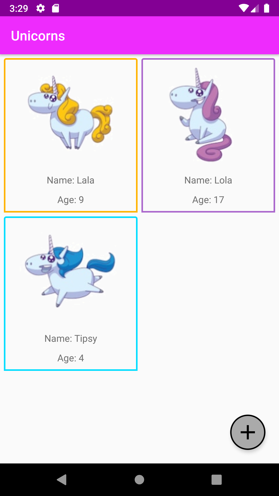
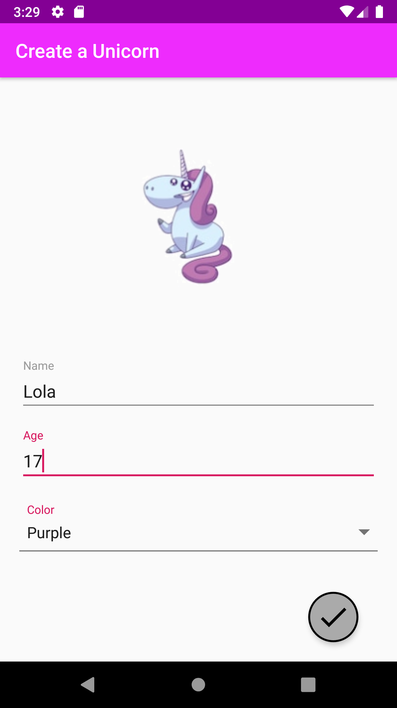

# Unicorns
This is an Android App to create and delete Unicorns. It is developed in Java. The Unicorns are saved locally on the device and online on a webserver.

## Motivation
I created this app due to a Job interview. During the process, I learned a lot of new things, and this is why I use the app to supplement my portfolio.

## Getting started
This project uses the Gradle build system. To build this project, use the gradlew build command or use "Import Project" in Android Studio.

## Screenshots

## Libraries used
* [AppCompat](https://developer.android.com/topic/libraries/support-library/packages)
* [GreenDao](http://greenrobot.org/greendao/) to create the local database.
* [RecyclerView](https://developer.android.com/guide/topics/ui/layout/recyclerview)
* [Volley](https://developer.android.com/training/volley) for HTTP requests
* [Livecycle Extension](https://developer.android.com/jetpack/androidx/releases/lifecycle) to use ViewModel class for MVVM architecture

## Backend Webserver
I am using [crudcrud](https://crudcrud.com/) as a backend webserver, because it is enough for my simple application and is ready to use. The URL in the SyncAdapter class has to be updated, because it expires after 24 hours.

## What I learned
* How to implement a SyncAdapter
* How to create Offline-First applications
* How to use MVVM architecture
* Using Volley library
* Using databinding
* Using GreenDao library to easily create SQLite databases

## Author
Andreas Pribitzer
